Extra Tips
==========

Run Interactive Jobs
--------------------

You can ask for a Bash terminal on one or more nodes and then execute all the commands you want. This kind of job is called an **interactive job**.

Interactive jobs are not resource efficient, so their usage should be **limited** to those cases in which it's not possible to use a job script; for example, you might need to interactively debug a code running on GPUs.

As an example, this command asks for 1 CPU on a node either in regular1 or in regular2, for 30 minutes:

.. code-block:: console
   
   $ srun --partition=regular1,regular2 --time=00:30:00 --ntasks=1 --cpus-per-task=1 --pty bash -i
   
:code:`srun` supports a set of options similar to :code:`sbatch`; for more info, refer to the manual page: https://slurm.schedmd.com/srun.html.

Run Quick, High-Priority Jobs
-----------------------------

You can run a single, **really high-priority** job (e.g. for debugging) by using the ``fastlane`` QoS (Quality of Service), i.e.

.. code-block:: console

   $ sbatch --qos=fastlane send_job.sh

.. warning:: Using the `fastlane` QoS is **not free**, in the sense that you will be "punished" by lowering the proprity of your subsequent jobs. So, use it **only if you really need it!**

You can get a list of the available QoS's via:

.. code-block:: console
   
   $ sacctmgr show qos format=name,priority
         Name   Priority
   ---------- ----------
       normal          0
     fastlane   10000000
         wide          0
         long          0
    priority1     500000

Disable Hyper-Threading
-----------------------

If you want to **totally disable** Hyper-Threading, you can use

.. code-block:: console

   $ sbatch --hint=nomultithread --cpu-bind=cores send_job.sh

Explore Files in a User-Friendly Way
------------------------------------

.. warning:: As long as Ulysses 2 is in beta, you still have to be under VPN!

You can read and write files on the cluster without necessarily using ``scp`` or ``sftp`` from the command line, so that you can navigate files as if they were on a normal folder on your computer.

There are two main ways to do that:

* by using the SFTP protocol though you system's native file browser
* by using SSHFS

SFTP -- Linux
^^^^^^^^^^^^^

Basically every major modern file browser has SFTP support. This guide uses Nautilus (the default file browser) from a recent version of Ubuntu; it should be similar in other distributions.

SFTP should be installed by default. If for some reason it's not, fire up a terminal and install it via

.. code-block:: console

   $ sudo apt install gvfs-backends
   
Then, open the file browser and click on "Other Locations" on the sidebar:

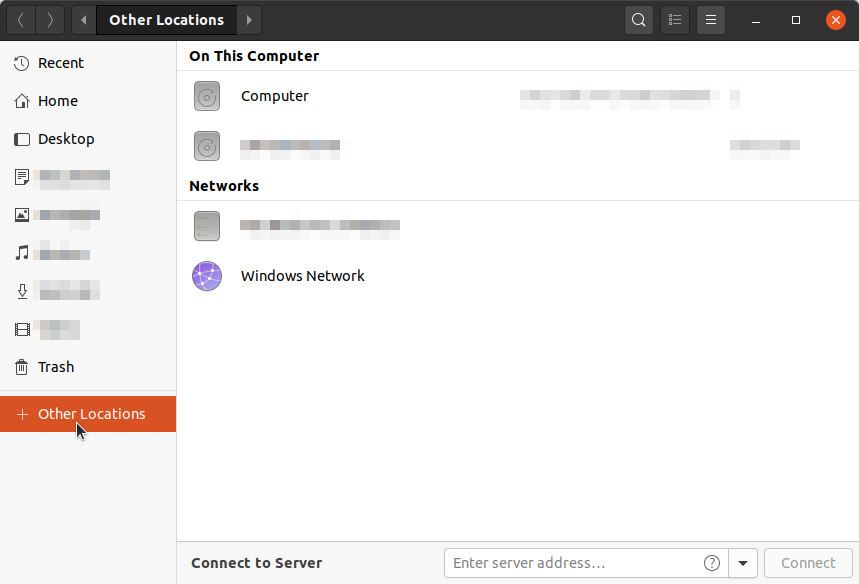
   
You should see a "Connect to Server" field at the bottom of the window; fill it with the following SFTP address

.. code-block:: console

   sftp://user@frontend2.hpc.sissa.it/

where ``user`` is your SISSA username. Then, click "Connect":

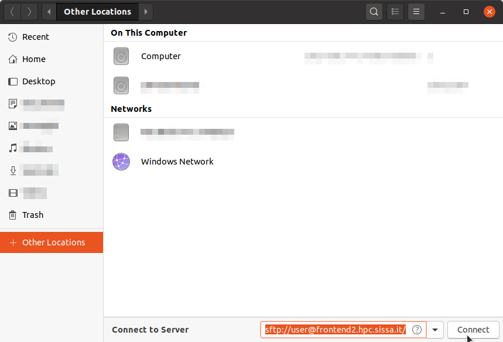

You might see a message warning about connecting to the server for the first time. If that's the case, you can click on "Log in anyway".

Then, just insert your password and check the box "Remember Password" so that you don't have to insert it next time:

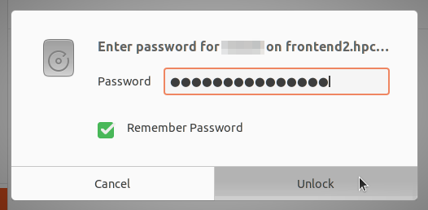
   
At this point, you should see the Ulysses' folder structure.

First of all let's create a bookmark so you don't have to repeat this procedure next time. Just go to the entry in the left sidebar that says *user on frontend2.hpc.sissa.it*, right-click on it and select "Add Bookmark".

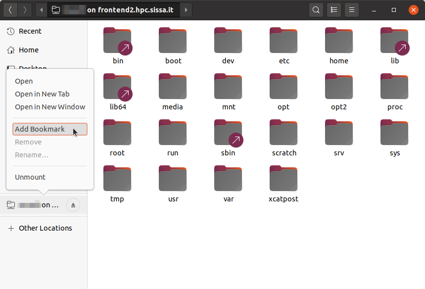
   
You should see a new entry with the same name in the left sidebar; just right-click on this new entry and select "Rename":

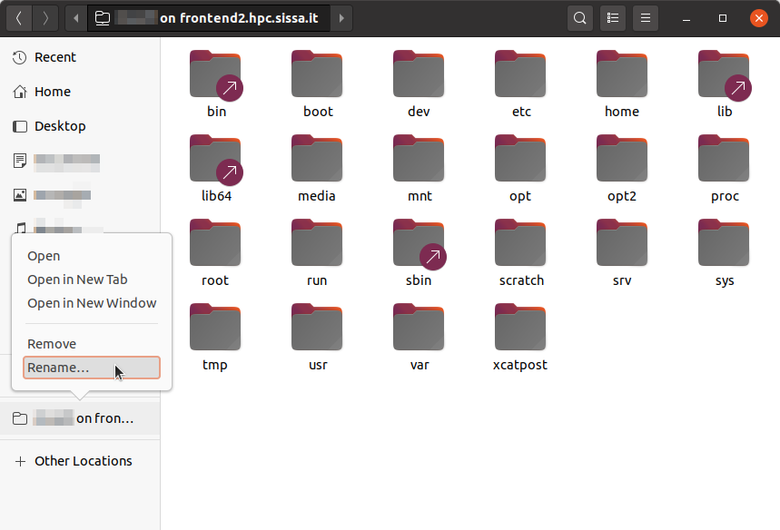

Give it the name you want, for example "Ulysses SFTP Drive":

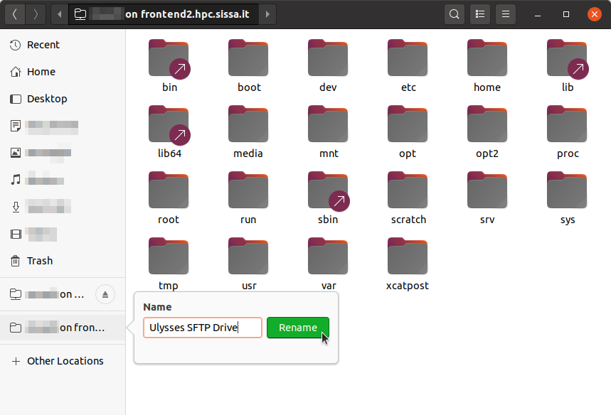
   
Then, the next time you want to access the cluster storage, just click on the "Ulysses SFTP Drive" bookmark in the left panel.

When you've finished you can safely unmount the cluster's storage by clicking on the "Eject" icon:

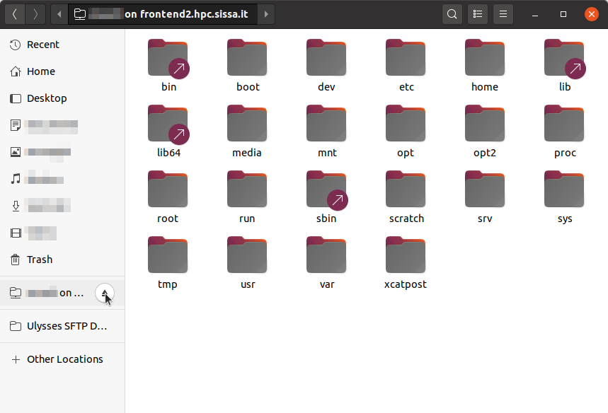
   
.. note:: The bookmark brings you by default in your home folder. If you want to change directory without navigating the full tree (which can be slow), just press "Ctrl + L" and add the path you want to go to at the end of the address. For example, if you want to visit the ``/scratch/username`` folder on Ulysses, where ``username`` is your SISSA username, you can put the following address in the top bar ``sftp://username@frontend2.hpc.sissa.it/scratch/username``:

   .. figure:: res/sftp_ubuntu_08.png
      :width: 100%
      :alt: sftp_ubuntu_08
      :align: center

.. warning:: Mounting a folder via the SFTP protocol doesn't make it behave *exactly* as a local folder. For example, you cannot open a *local* terminal in it. However, you should be able to right-click into the folder and see an option "Open in Remote Terminal" that opens a **remote** terminal in that folder, i.e. connects to Ulysses via SSH and moves the terminal to that folder. This means that you cannot copy/paste or move files from Ulysses to your local computer via the terminal; you can do that only via the graphical interface. For a more flexible solution that allows you to open *local* terminals, you might want to take a look at the section :ref:`SSHFS -- Linux`.

SFTP -- MacOS
^^^^^^^^^^^^^

Finder does not natively support SFTP. You have to resort to a third-party solution or use SSHFS (see the section :ref:`SSHFS -- MacOS`).

SFTP -- Windows
^^^^^^^^^^^^^^^

Windows Explorer does not natively support SFTP. You have to resort to a third-party solution or use SSHFS (see the section :ref:`SSHFS -- Windows`), though even SSHFS requires installing additional software.

SSHFS -- Linux
^^^^^^^^^^^^^^

SSHFS allows you to use a local folder as an entry point (called "mount" point) for a remote folder, i.e. it allows you to show the contents of a remote folder ``B`` as if they were into a local folder ``A``.

Again, we'll see Ubuntu as an example; the procedure, however, should be similar on other systems as well.

First of all, if you don't have SSHFS, install it via

.. code-block:: console

   $ sudo apt install sshfs
   
Then, create the folder that you want to use as a mount point. This folder can be in whatever place you like: in "Documents", in "Home", etc.; the only requirement is that you have to have the permissions to create the folder. On SISSA workstations, I suggest you to create a subfolder in the `/scratch/username/` folder of your workstation; **don't** use the home folder!

You can create the folder either via the graphical file browser or via the terminal, for example I decided to make a folder ```"/scratch/username/Ulysses SFTP Drive"``:

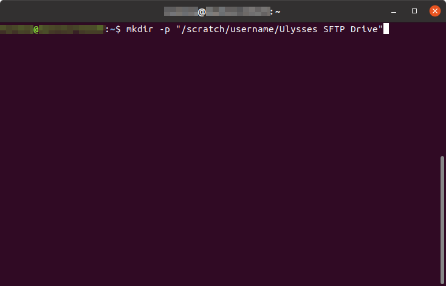
   
Then, you can "connect" this local folder to the cluster storage via the following command:

.. code-block:: console

   $ sshfs username@frontend2.hpc.sissa.it:/ /scratch/username/Ulysses\ SFTP\ Drive -o reconnect -o fsname="Ulysses SFTP Drive"

where ``username`` is your SISSA username, ``/scratch/username/Ulysses\ SFTP\ Drive`` has to be replaced with the path of the folder you've created, and ``"Ulysses SFTP Drive"`` is just a name that you can change as you want:

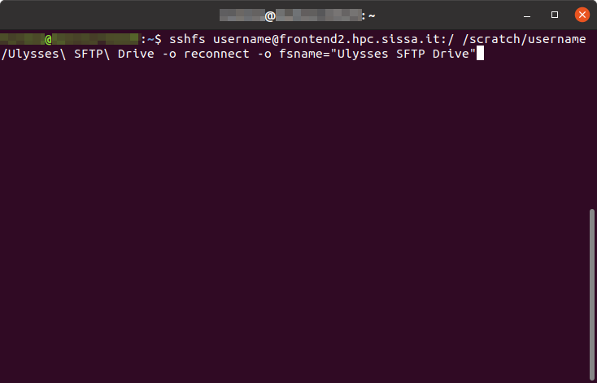

At this point you should see a device called "Ulysses SFTP Drive" in the left panel of the fole browser. Right-click on it and select "Add Bookmark", so that after you eject it you can just click on the bookmark to connect again.

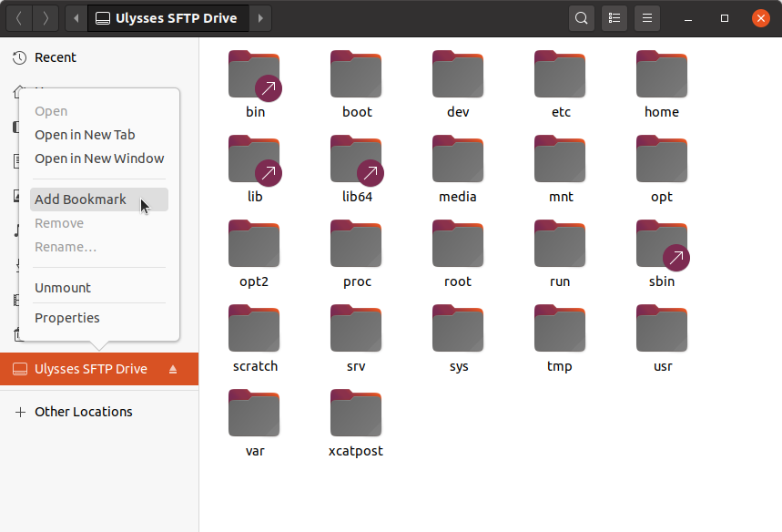

.. note:: If you want to change directory without navigating the full tree (which can be slow), just press "Ctrl + L" and add the remote path you want to go to **after** the path of the local folder. For example, if you want to visit the ``/home/username`` folder on Ulysses, where ``username`` is your SISSA username, and the local mount point is ``"/scratch/username/Ulysses SFTP Drive"``, you have to use the following address in the top bar ``/scratch/username/Ulysses SFTP Drive/home/username``:

   .. figure:: res/sshfs_ubuntu_04.png
      :width: 100%
      :alt: sshfs_ubuntu_02
      :align: center

.. warning:: Unmounting the volume via the "Eject" icon might not work (it complains about permissions). It's a known bug; if it happens, you can unmount the volume by opening a terminal and using

   .. code-block:: console
   
      $ fusermount -u "/scratch/username/Ulysses SFTP Drive"

   where ``"/scratch/username/Ulysses SFTP Drive"`` has to be replace with your local mount point.

SSHFS -- MacOS
^^^^^^^^^^^^^^

The steps for MacOS are similar to the ones outlined in :ref:`SSHFS -- Linux` (have a read), with the notable exception that **you don't have to create the local folder**.

To install SSHFS on MacOS, first install `HomeBrew <https://brew.sh>`_. Then, fire up a terminal and execute

.. code-block:: console

   $ brew install osxfuse
   
You can finally mount Ulysses' storage, for example in :ref:``/Volumes/Ulysses\ SFTP\ Drive``, by executing in a terminal:

.. code-block:: console

   $ sshfs username@frontend2.hpc.sissa.it:/ /Volumes/Ulysses\ SFTP\ Drive -o local -o volname="Ulysses SFTP Drive" -o auto_cache,reconnect,defer_permissions,noappledouble

.. note:: In order to avoid repeating this command every time, you can put it in a Bash script and just execute the Bash script when you want to connect.

.. note:: You can skip the manual navigation of the tree in a way similar to the "Ctrl + L" command described for Ubuntu. In MacOS, you have to use "Command + Maiusc + G" and insert the address (e.g. referring to the same example above) ``/Volumes/Ulysses SFTP Drive/home/username``.

Unmounting should work by just right-clicking on the drive and select "Eject", or by using the "Eject" icon in the Finder. If that doesn't happen or if you receive an error about the position already existing when you use the ``sshfs`` command again, you can manually force-unmount via the following terminal command:

.. code-block:: console

   $ umount -f /Volumes/Ulysses\ SFTP\ Drive
   
**Note** that the command is *umount*, **not** *unmount*.

**Extra Tip.** On MacOS, you can customize the appearance of the mounted drive. For example you can create or download an icon that you like and let's say that you've stored it as ``/Users/YOURNAME/.local/share/icons/sissa_drive.icns``. Then, in order to use it for your drive, add the following option to the ``sshfs`` command above:

.. code-block:: console

   $ -o modules=volicon,iconpath=/Users/YOURNAME/.local/share/icons/sissa_drive.icns

SSHFS -- Windows
^^^^^^^^^^^^^^^^

To make SSHFS work in Windows, we need to install some third-party drivers. I've tested the open-source solution below and it seems to work fine on Windows 10.

* First, install `WinFsp <https://github.com/billziss-gh/winfsp/releases/latest>`_. Keep all the default options.
* Then, install the `SSHFS-Win <https://github.com/billziss-gh/sshfs-win/releases/latest>`_ as well. If you receive a warning about the computer being protected by Windows, click on "More info" and then on "Run anyway". Keep all the default options.

At this point, open Windows File Explorer, right-click on "This PC" in the left panel and then "Map Network Drive". Choose a drive letter to map to Ulysses (I've chosen ``U:`` as "Ulysses" 🙃) and use the following address:

.. code-block:: console

   \\sshfs.r\username@frontend2.hpc.sissa.it

where ``username`` is your SISSA username. You can choose whether to reconnect at sign-in or not.

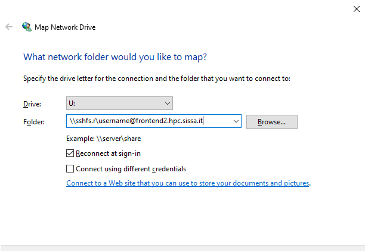

You will be prompted with user/pass:

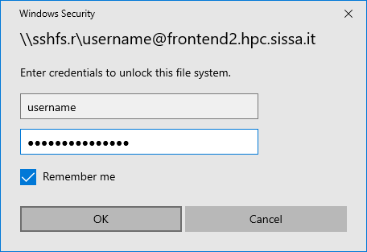

and then you should be set! 😄

.. only:: html or epub

   The guide of SSHFS-Win has also a nice animation of the whole procedure (just be sure to use the correct SISSA address I've put above):

   .. figure:: res/sshfs_windows_capture.gif
      :width: 100%
      :alt: sshfs_windows_capture
      :align: center
      
      Animation taken from the `guide <https://github.com/billziss-gh/sshfs-win>`_ of SSHFS-Win.

.. warning:: On Windows, folder paths use a ``\`` instead of the ``/`` used on Linux and MacOS!
